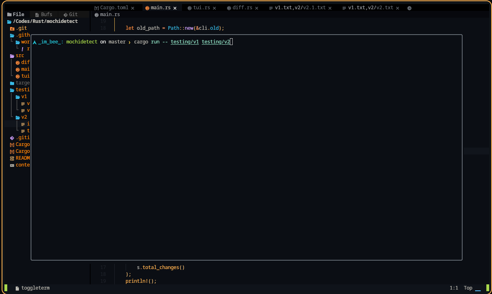
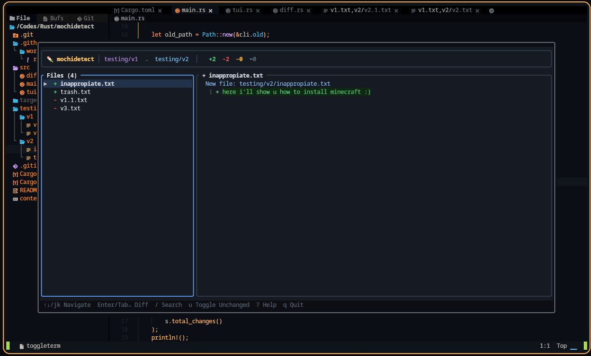

# 🦉 mochidetect

> Smart diff tool for comparing versions/projects with an interactive TUI  
> Built in Rust • Terminal-native • AI-assisted development friendly

---

## ⚡ Quick Install

```bash
# Clone + install in one go
git clone https://github.com/gh-mochi-org/mochidetect
cd mochidetect
cargo install --path .

# Binary lands in ~/.cargo/bin/mochidetect
# Make sure ~/.cargo/bin is in your $PATH
```

### Or just run it locally:
```bash
git clone https://github.com/gh-mochi-org/mochidetect
cd mochidetect
cargo run -- ./testing/v1 ./testing/v2
```

### Or download a release *(when available)*:
```bash
# Grab latest from GitHub Releases
curl -LO https://github.com/gh-mochi-org/mochidetect/releases/latest/download/mochidetect
chmod +x mochidetect
sudo mv mochidetect /usr/local/bin/
```

---

## 🚀 Usage

```bash
mochidetect <OLD_PATH> <NEW_PATH> [OPTIONS]
```

### Examples
```bash
# Compare two folders (opens interactive TUI)
mochidetect ./v1 ./v2

# Plain text output (good for scripts/CI)
mochidetect ./old ./new --plain

# Show only changes, hide unchanged files
mochidetect ./a ./b --summary

# Filter by file extension
mochidetect ./src1 ./src2 --ext rs

# Show everything including unchanged
mochidetect ./before ./after -a

# Combine flags
mochidetect ./v1 ./v2 --plain --ext rs --summary
```

### Output Symbols
| Symbol | Meaning | Color |
|--------|---------|-------|
| `+` | Added | 🟢 |
| `-` | Removed | 🔴 |
| `~` | Modified | 🟡 |
| `=` | Unchanged | ⚪ |

---

## ⌨️ TUI Controls

**Navigation**
- `↑` / `k` — Move up
- `↓` / `j` — Move down
- `PgUp` / `PgDn` — Fast scroll
- `g` / `Home` — Jump to top
- `G` / `End` — Jump to bottom
- `Tab` / `Enter` — Switch panels
- `Esc` — Back to file list

**Actions**
- `/` — Search files by name
- `u` — Toggle showing unchanged files
- `?` — Toggle help overlay
- `q` / `Ctrl+C` — Quit

---

## 📦 Options Reference

| Flag | Short | Description |
|------|-------|-------------|
| `--plain` | `-p` | Plain terminal output instead of TUI |
| `--all` | `-a` | Show unchanged files too |
| `--ext <ext>` | `-e` | Filter by file extension (e.g. `rs`, `py`) |
| `--summary` | `-s` | Show stats only, no file listing |
| `--help` | `-h` | Show help message |
| `--version` | `-V` | Show version |

---

## 🧪 Try It Out

```bash
# Use the bundled test folders
mochidetect ./testing/v1 ./testing/v2

# Or compare your own projects
mochidetect ~/projects/app-v1 ~/projects/app-v2
```

---

## 🛠️ Build from Source

```bash
git clone https://github.com/gh-mochi-org/mochidetect
cd mochidetect
cargo build --release
# Binary: ./target/release/mochidetect
```

---

## 📁 Project Layout

```
mochidetect/
├── Cargo.toml
├── src/
│   ├── main.rs   # CLI + args
│   ├── diff.rs   # Core diff logic
│   └── tui.rs    # Interactive UI
└── testing/      # Sample data for manual tests
```

---

## 🤝 Contributing

1. Fork it
2. `git checkout -b feat/your-idea`
3. Code + test
4. PR it 🎉

---

## 📜 License

MIT

---

### examples:




---

> 💡 **Tip**: Run `mochidetect ./testing/v1 ./testing/v2` right after install to see it in action!

*Made with 🍡 by gh-mochi-org & idotconfig*

